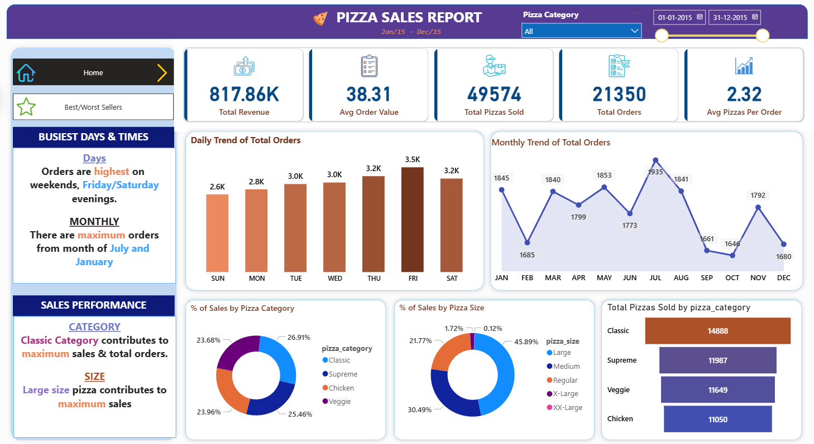
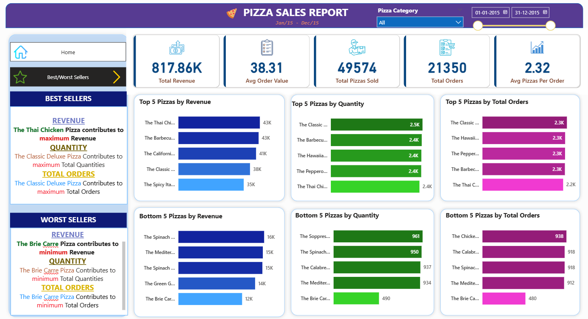

# 🍕 Sales Performance & Revenue Analytics Dashboard (48,000+ Records)

## 📊 Project Overview

This project analyzes over **48,000+ pizza sales records** to uncover key business insights related to revenue trends, product performance, and customer demand patterns.

The objective was to transform raw data into an **interactive Power BI dashboard** and generate actionable insights to support data-driven decision-making.

---

## 🛠️ Tools & Technologies

* **Power BI** – Dashboard development & visualization
* **SQL (SQL Server)** – Data extraction and analysis
* **Excel** – Data cleaning and preprocessing

---

## 📁 Dataset

* Transaction-level dataset with **48,000+ records**
* Key fields:

  * Order ID, Date & Time
  * Pizza Name, Category, Size
  * Quantity & Revenue

---

## 📈 Key Business Insights

* **Friday is the highest demand day (3,538 orders)**, while Sunday shows lowest sales
* **July recorded the highest monthly orders**, whereas October had the lowest
* **Classic category contributes the highest revenue (26.91%)**
* **Large size pizzas dominate sales (46.37%)**, indicating strong preference for bigger portions
* **Top-performing pizzas are mostly chicken-based**, led by Thai Chicken Pizza
* Certain products like *Brie Carre Pizza* show consistently low performance

---

## 📊 Dashboard Preview

### Sales Overview

### Product & Category Analysis

---

## 🧮 SQL Analysis Snapshot

### KPI Queries

Calculated key business metrics such as total revenue, total orders, average order value, and average pizzas per order.

---

### Daily Trend Analysis

Analyzed order volume across days of the week to identify peak demand periods.

---

### Sales Contribution by Category

Evaluated how each pizza category contributes to total revenue.

---

### Top 5 Best-Selling Pizzas by Revenue

Identified the highest revenue-generating pizza products.

---

## 📄 Business Insights Report

A concise report summarizing key findings and recommendations based on the analysis.

[Download Report](business_insights_report.pdf)

---

## 📂 Project Files

* `pizza-sales-dashboard-powerbi.pbix`
* `pizza_sales_analysis.sql`
* `pizza_sales_dataset.xlsx`
* `business_insights_report.pdf`
* `images/` (dashboard & SQL screenshots)

---

## 💡 Business Recommendations

* Introduce **weekday promotions** to improve low-demand periods
* Focus marketing efforts on **top-performing pizzas**
* Re-evaluate or improve **low-performing products**
* Promote **large-size combos** to maximize revenue
* Plan **seasonal campaigns** for low-performing months

---

## 🚀 Conclusion

This project demonstrates an end-to-end data analysis workflow — from raw data processing using SQL to building interactive dashboards in Power BI and deriving actionable business insights.

---

## 📬 Contact

If you have any feedback or opportunities, feel free to connect.

